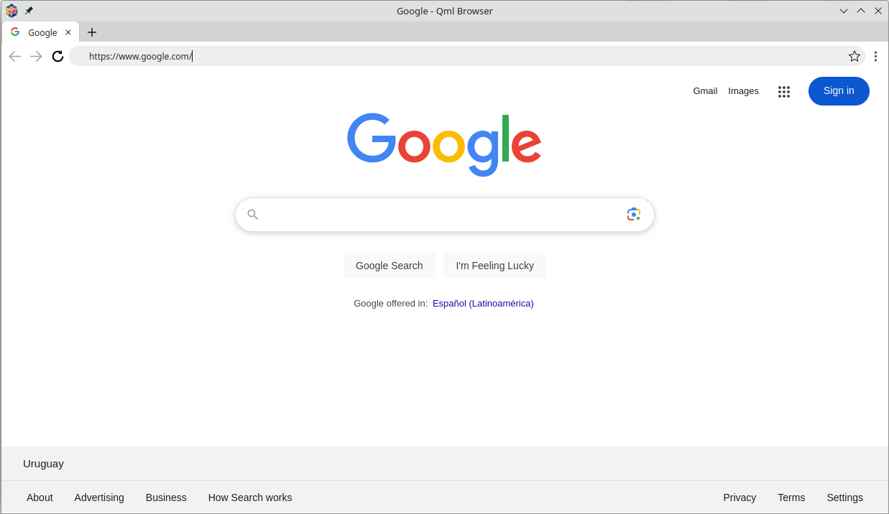

# QmlBrowser

QmlBrowser is full-featured Chromium based open-source web browser
with QML pages support.



is next generation of Web 3.0 browser.
It use modern QML language to fill the pages with incredible features.
It support 3D functionality in the core and can render it fast on any hardware.

## Downloads

Available on [Release](https://github.com/Toorion/qml-browser/releases) page

## Building

### Linux
```sh
mkdir build && cd build
qmake ..
make && make install
```

### Windows

Use QtCreator to build 
Kit QT + MSVC2019

## Demo

[QML Demo page](http://demo.qbqsoft.com)

[QML Demo source](https://github.com/Toorion/qml-browser-demo)

\* Can only be opened using QmlBrowser

## Open QML pages

For opening QML pages it should have 

Content-Type: text/qml

## 3D Configuration

The default 3D graphics renderer is RHI

It's working perfectly, but if you want to, you can override this default behaviour by setting QT_QUICK_BACKEND environment variable.

Available options:

* rhi - RHI renderer (default)
* software - software adaptation
* openvg - OpenVG renderer

### Linux

The default 3D graphics API for Linux - OpenGL

It's working perfectly, but if you'd like, you can override this default behaviour by setting the QSG_RHI_BACKEND environment variable

Available option:

* opengl - OpenGL (default)
* vulkan - Vulkan 3D API (requires installation of Vulkan 3D API software)
* null - No 3D API

### Windows

The default 3D graphics API for Windows depends on the graphics driver you are using. 

It can be OpenGL ES (which is fast, but has some [functional limitations](https://doc.qt.io/qt-6/qtquick3d-requirements.html#opengl-es-2-0-support)

It can also be Direct3D 11, which can sometimes be very slow.

You can override this default behaviour by setting the QSG_RHI_BACKEND environment variable

Available option:

* opengl - OpenGL
* d3d11 - Direct3D API
* vulkan - Vulkan 3D API (requires Vulkan 3D API software to be installed)
* metal - Metal 3D API (requires Metal 3D API software to be installed)
* null - No 3D API

## QML advantages over HTML

|           |QML              |  HTML   |
|:----------|:---------------:|:-------:|
| Oriented to |  2D / 3D | Text markup |
| Extendable |  Yes | No |
| Reusable |  Yes | No |
| Flexibility | High | Low |
| 3D performance | Fast | Slow |
| Development time |  Low | High |


* HTML describes how to structure text documents and links on the web. Overtime it was extended with JS and CSS to let you do much more but at it's core it is a text document rendering technology.
* QML was designed to describe how 2D and 3D spacial elements relate and interact with each other. It can still render text but that is not it's focus. QML is much more concerned with creating a user experience rather than presenting textual information.

## Contact

Email: <toorion@gmail.com>

Telegram: [@qmlbrowser](https://t.me/qmlbrowser)

## ToDo

- Page loading progressbar
- Local data storage for QML pages
- Network adapter for QML mode
- Expand API model for QML pages
- Bookmarks
- Lot of something else 
